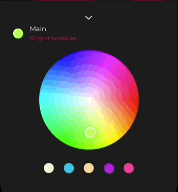

<br><br>
# Lighting


Lighting is a Swyft component that allows the user to adjust the intensity of several light sources. 

- [Requirements](#requirements)
- [Installation](#installation)
- [License](#license)

Lighting consists of several sliders and buttons that allow the user to pick a room, switch on a light, and adjust its intensity. It is also possible to select the desired color for every available light source. 


Here is an example of a Lighting animation showing room selection and switching on the lights:


The user can adjust the brightness for all sources at once with a vertical slider:


The user can select various light colors using a convenient round palette:



## Requirements

- iOS 11.0+
- Xcode 11.0+
- Swift 5.0+

## Installation

### CocoaPods

To integrate Lighting into your Xcode project with CocoaPods, specify it in your `Podfile`:

```ruby
pod 'Lighting', :git => 'https://github.com/shakurocom/LightingDemo.git', :commit => 2c406f7e7400188bc4dcbfab346a30bbec7ebb07
```

Then, run the following command:

```bash
$ pod install
```

### Manually

If you prefer not to use CocoaPods, you can integrate Shakuro.Lighting simply by copying it to your project.

## License

Shakuro.Lighting is released under the MIT license. [See LICENSE](https://github.com/shakurocom/ScrollableTabs/blob/master/LICENSE.md) for details.

## Give it a try and reach us

Explore our expertise in <a href="https://shakuro.com/services/native-mobile-development/?utm_source=github&utm_medium=repository&utm_campaign=lighting-demo">Native Mobile Development</a> and <a href="https://shakuro.com/services/ios-dev/?utm_source=github&utm_medium=repository&utm_campaign=lighting-demo">iOS Development</a>.</p>

If you need professional assistance with your mobile or web project, feel free to <a href="https://shakuro.com/get-in-touch/?utm_source=github&utm_medium=repository&utm_campaign=lighting-demo">contact our team</a>
